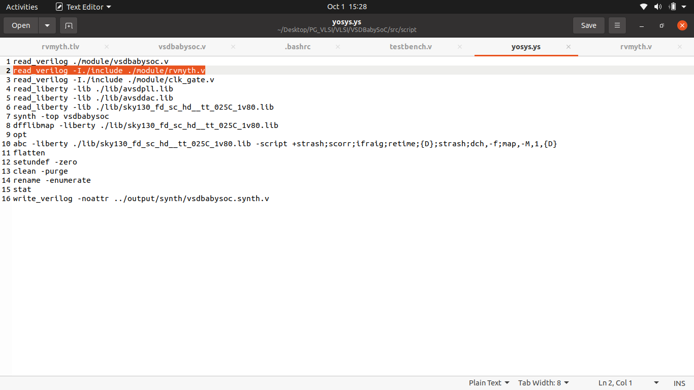
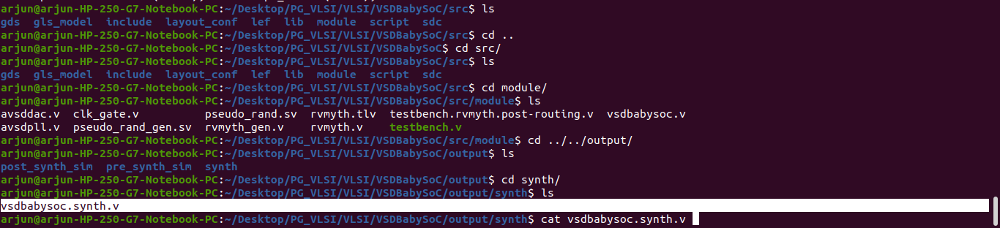
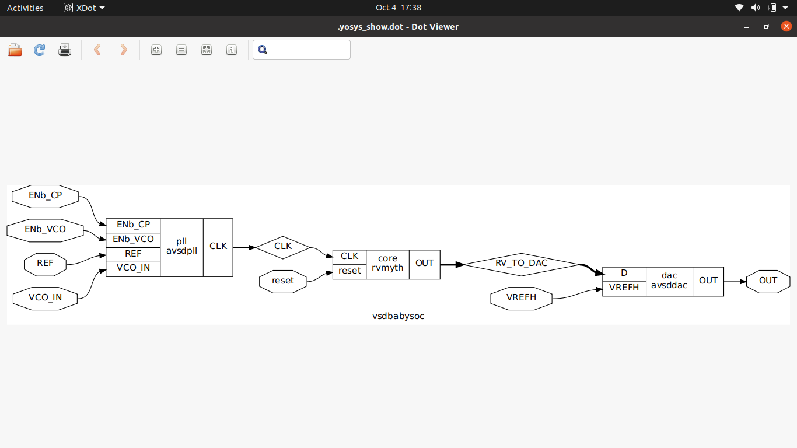

# Simulation and analysis of VSDBabySoC
-----------

### 1. Clone the VSDBabySoC project repo
```bash
   $ git clone https://github.com/manili/VSDBabySoC.git
   $ cd VSDBabySoc
   $ mkdir -p output/pre_synth_sim                   // store presynthesis simulation results
```
### 2. Convert tlv to verilog 

```bash
   $ pip install pyyaml click sandpiper-saas       // these packages are required to convert tlv to verilog
   $ show pyyaml click sandpiper-saas             // check whether these packages are successfully installed or not
```
<p align="center">
  
</p>

```bash
   $ sandpiper-saas -i ./src/module/*.tlv -o rvmyth.v --bestsv --noline -p verilog --outdir ./src/module
```
<p align="center">
  
</p>
Now tlv (transaction level verilog) to verilog conversion of rvmyth (RISC-V core) is successful.

### 3. Pre Synthesis Simulation
```bash
   $ iverilog -o output/pre_synth_sim/pre_synth_sim.out -DPRE_SYNTH_SIM \
    -I src/include -I src/module \
    src/module/testbench.v src/module/vsdbabysoc.v
   $ cd output/pre_synth_sim
   $ ./pre_synth_sim.out
   $ gtkwave pre_synth_sim.vcd
```
<p align="center">
  
</p>

- clk, reset is global signal.
- RV_TO_DAC is digital from rvmyth core sent to DAC.
- OUT is output of DAC which is analog version of 10 bit RV_TO_DAC signal.

### 4. synthesis 
```bash
   $ cd ..
   $ mkdir synth
   $ cd ..
   $ cd src
   $ xdg-open ./script/yosys.ys  //// edit and fix the path for rvmyth.v in this syntheis script file
```
<p align="center">
  
</p>

```bash
   $ yosys ./script/yosys.ys  // this runs the synthesis script and generates gate level netlist
   $ ls ../output/synth/
```
<p align="center">
  
</p>

### Block diagram of the BabySoc (Synthesized version)
<p align="center">
  
</p>


